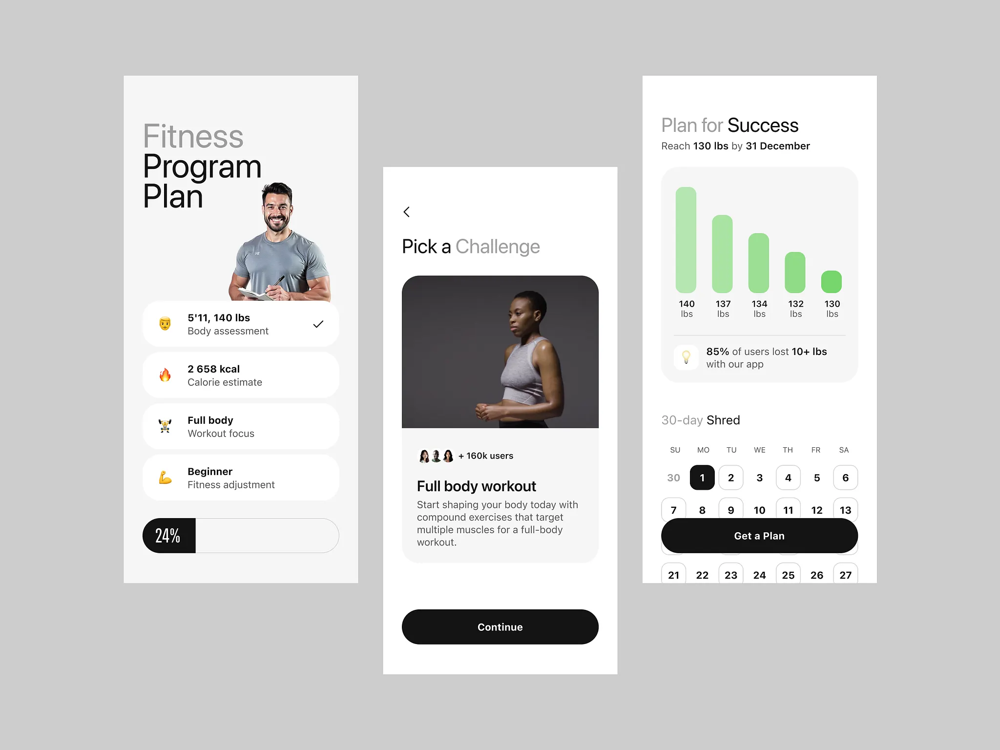
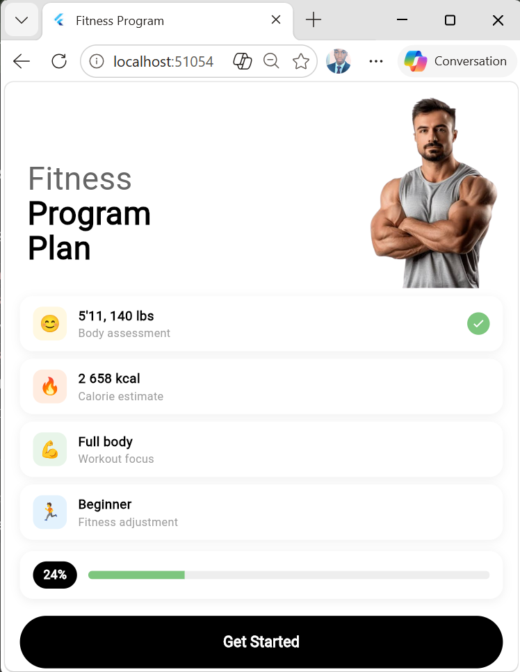
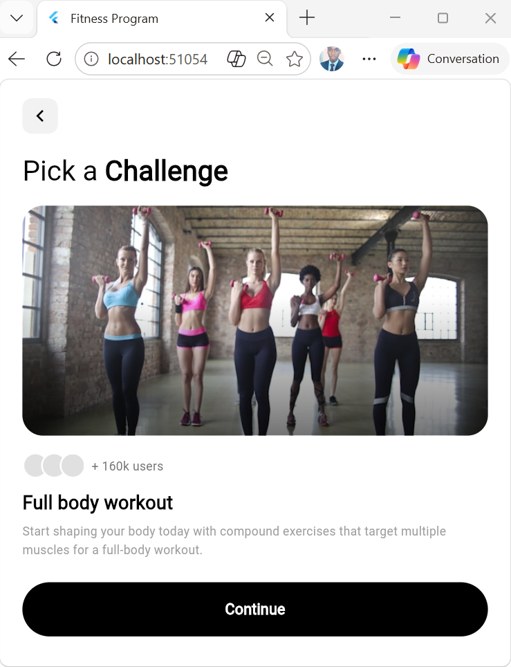
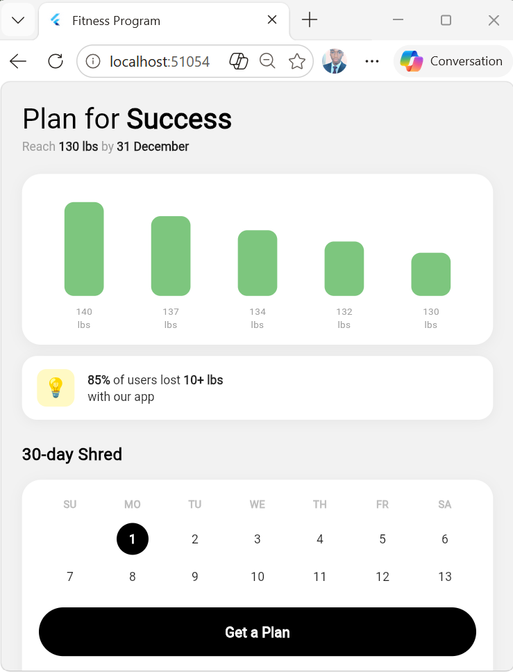

# 🏋️ Finalix — Fitness App Flutter

Reproduction fidèle d'une maquette Dribbble en Flutter.

## 🔗 Maquette originale Dribbble

👉 [Fitness App — dribbble.com/shots/26913868](https://dribbble.com/shots/26913868-Fintess-app)

## 📸 Aperçu

### Maquette originale


### Réalisation Flutter
| Écran 1 | Écran 2 | Écran 3 |
|---|---|---|
|  |  |  |

## 📱 Description

**Finalix** est une application mobile Flutter reproduisant une interface fitness moderne composée de 3 écrans :

- **Program Plan** — Vue d'ensemble du programme fitness : stats personnelles, barre de progression 24%
- **Pick a Challenge** — Sélection du défi workout avec compteur d'utilisateurs
- **Plan for Success** — Objectif de poids, graphique de progression, calendrier 30-day Shred

## 🎨 Design

- **Palette** : Blanc `#FFFFFF`, Noir `#000000`, Vert `#7DC67E`
- **Style** : Minimaliste, cards avec ombres légères, boutons arrondis

## 🚀 Lancer le projet

```bash
flutter pub get
flutter run
```

## 📁 Structure

```
lib/
├── main.dart
└── screens/
    ├── program_plan_screen.dart
    ├── pick_challenge_screen.dart
    └── plan_success_screen.dart
assets/
└── images/
    └── hero_man.png
screenshots/
├── maquette_originale.png
├── screen1.png
├── screen2.png
└── screen3.png
```

## ⚠️ Difficultés rencontrées

- Reproduction du graphique en barres sans librairie externe
- Gestion du calendrier interactif avec état sélectionné
- Positionnement de la photo hero dans le header
- Chargement des images réseau avec fallback local

## 👨‍💻 Auteur

**Stanislas** — Institut International de Technologie (IIT) — Grand-Bassam